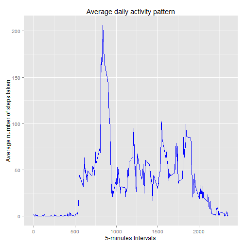
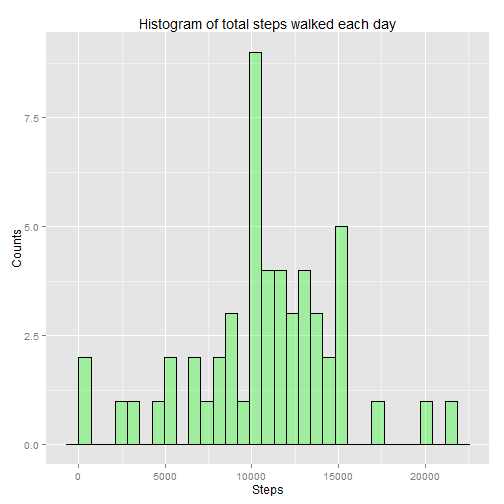
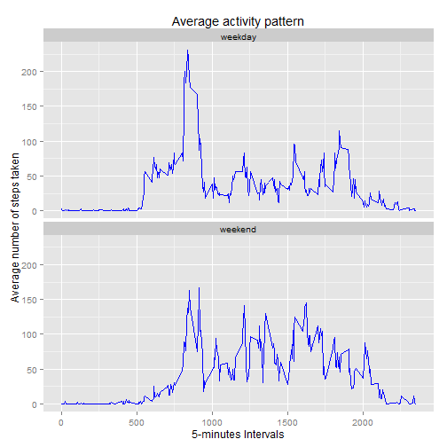

## Loading and processing the data
**Load the data into R object "data".**
Since we don't need to work with "NA"s in the first several questions, I'll omit them in the data for now and create another object "data1" for it.


```r
unzip("repdata-data-activity.zip")
data<-read.csv("activity.csv")
data1<-na.omit(data)
```

##What is the mean total number of steps taken per day?
**Calculate the total number of steps taken each day.**


```r
library(dplyr)
library(ggplot2)
by_day <- group_by(data1, date)
sum_by_day <- summarise(by_day, sum(steps))
colnames(sum_by_day) <- c("date", "steps")
```

**Make a histogram of the total number of steps taken each day.**


```r
g_steps_by_day <- ggplot(sum_by_day, aes(steps))
g_steps_by_day + geom_histogram(col = "black", fill = "green", alpha = .3) +
        labs(title = "Histogram of total steps walked each day", x = "Steps", y = "Counts")
```

```
## stat_bin: binwidth defaulted to range/30. Use 'binwidth = x' to adjust this.
```

 

**Calculate and report the _mean_ and _median_ total number of step taken per day.**

```r
summarise(sum_by_day, mean(steps), median(steps))
```

```
## Source: local data frame [1 x 2]
## 
##   mean(steps) median(steps)
## 1    10766.19         10765
```

##What is the average daily activity pattern?
**Make a time series plot of the 5-minute interval and the average number of steps taken, averaged across all days.**
I use ggplot to generate graphs for this purpose.


```r
by_interval <- group_by(data1, interval)
sum_by_interval <- summarise(by_interval, mean(steps))
colnames(sum_by_interval) <- c("interval", "mean_steps")
g_steps_by_interval <- ggplot(sum_by_interval, aes(interval, mean_steps))
g_steps_by_interval +
        geom_line(col = "blue") +
        labs(title = "Average daily activity pattern", x= "5-minutes Intervals", y = "Average number of steps taken")
```

 

**Which 5-minute interval, on average across all the days in the dataset, contains the maximum number of steps?**
I use "which.max" function to find the row index containing the maximum number of steps, and then subset the value of "interval" from that row.


```r
sum_by_interval[which.max(sum_by_interval$mean_steps),1]
```

```
## Source: local data frame [1 x 1]
## 
##   interval
## 1      835
```
Therefore the interval #835 appears to be the time when most steps were walked on an average day.
##Imputing missing values
From now on I'll start using the "data" object which contains the "NA" values.
**Calculate and report the total number of missing values in the dataset.**
I use !compete.cases() to count missing values.


```r
sum(!complete.cases(data))
```

```
## [1] 2304
```

**Devise a strategy for filing in all of the missing values in the dataset.**
I'd use the average number of steps taken in each time interval across all the days to replace these NA values. 

**Create a new dataset that is equal to the original dataset but with the missing data filled in.**
We already have a dataframe as a reference for the replacement, which is ```{r, echo=TRUE}sum_by_interval```. It contains the average steps the person walks on an average day. Now I want to replace the missing values according to this dataframe using a for loop. The results are stored back in the object "data2".


```r
data2 <- data
for (i in 1:nrow(data2)){
        if (is.na(data2[i,1])){
                data2[i,1] <- sum_by_interval[match(data$interval[i],sum_by_interval$interval),2]
        }
}           
```

**Make a histogram of the total number of steps taken each day and Calculate and reprot the _mean_ and _median_ total number of steps taken perday.**
Same as the beginning of the project, with new data.


```r
by_day2 <- group_by(data2, date)
sum_by_day2 <- summarise(by_day2, sum(steps))
colnames(sum_by_day2) <- c("date", "steps")
g_steps_by_day2 <- ggplot(sum_by_day, aes(steps))
g_steps_by_day2 + geom_histogram(col = "black", fill = "green", alpha = .3) +
        labs(title = "Histogram of total steps walked each day", x = "Steps", y = "Counts")
```

```
## stat_bin: binwidth defaulted to range/30. Use 'binwidth = x' to adjust this.
```

 

```r
summarise(sum_by_day2, mean(steps), median(steps))
```

```
## Source: local data frame [1 x 2]
## 
##   mean(steps) median(steps)
## 1    10766.19      10766.19
```
It is obvious that by replacing the NA values with a mean did not have any big impact on the mean and median of the data.
##Are there differences in activity patterns between weekdays and weekends?

**Create a new factor variable in the dataset with two levels -- "weekday" and "weekend" indicating whether a given date is a weekday or weekend day.**


```r
library(lubridate)
data2$date <- ymd(data2$date)
data2$day <- weekdays(data2$date)
data2$day_type<- "weekday"
data2$day_type[data2$day %in% c("Saturday","Sunday")] <- "weekend"
data2$day_type <- as.factor(data2$day_type)
```

**Make a panel plot containing a time series plot (i.e. type = "l") of the 5-minute interval (x-axis) and the average number of steps taken, averaged across all weekday days or weekend days (y-axis).**


```r
data2$interval <- as.numeric(data2$interval)
Step_by_day_type <- data2 %>%
        group_by(day_type, interval)%>%
        summarize (steps = mean(steps))
ggplot(data = Step_by_day_type, aes(interval, steps)) +
        geom_line(col = "blue") +
        labs(title = "Average activity pattern", x= "5-minutes Intervals", y = "Average number of steps taken") +
        facet_wrap(~day_type, nrow = 2)
```

 
From the graphs we can see that there are some difference in the activity pattern of this person on weekdays vs. on weekends. Briefly, the person tends to walk more in the morning on weekdays, but much less in other periods of the weekday. On the weekends, the person's walking activity appears to spread across the whole day.
